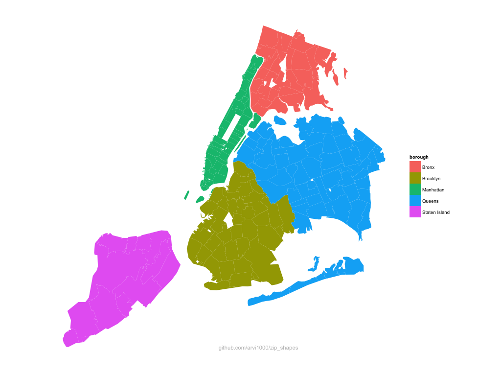

Here's some R code to:

* `load_usa_zip_shp.R`: download/unzip/load shapefiles from census.gov (creates local copy for subsequent use)
* `scrape_nyc_zips.R`: scrape a list of zip codes by borough in NYC (from [health.ny.gov](https://www.health.ny.gov/statistics/cancer/registry/appendix/neighborhoods.htm), the first google hit)
* `plot_nyc_shp.R`: plot the nyc zip shapes with ggplot2

I hope it's a generally useful starting point for any kind of zipcode-based plotting task

